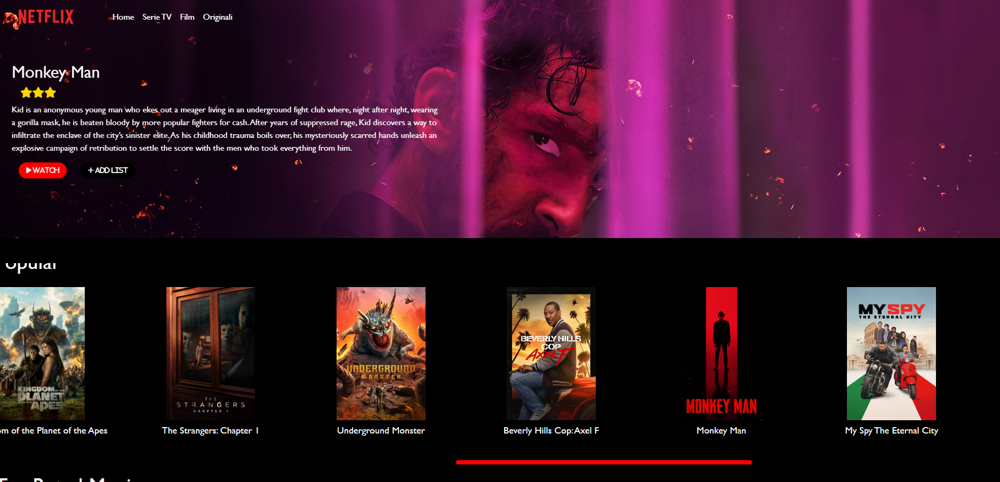

<h1>
  Replica del layout di Netflix
</h1>

<h3>
  Realizzato interamente con Vue.js e Bootstrap, le sezioni sono state popolate tramite chiamate Ajax, e vi è stata implementata la funzione di ricerca per categoria e/o nome sempre tramite chiamata Ajax.
</h3>

  Setup iniziale:
  <ul>
      <li>
        scaricare cartella in locale
      </li>
      <li>
        da terminale inserire il comando : 'npm i'
      </li>
     <li>
        successivamente, sempre da terminale avviare il server di sviluppo 'npm run dev'
      </li>
  </ul>

